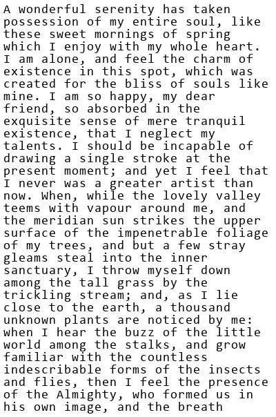
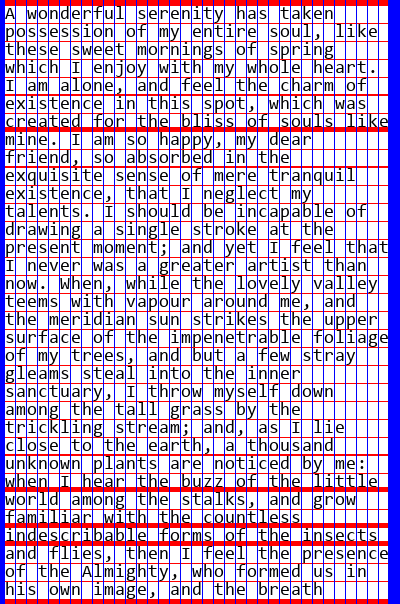

# CharacterSeparation

**CharacterSeparation** is a Java-based image processing utility that detects whitespace rows and columns in text-heavy bitmap images. This is intended for use as a preprocessing step in applications such as OCR and machine learning pipelines.

## Overview

This project processes 24-bit BMP images of text and identifies areas of whitespace that separate lines and characters. These separations are marked visually and returned as lists of row and column indices.

- Each pixel is treated as a node in a graph.
- Edges connect adjacent pixels, with weights based on pixel brightness.
- A virtual source node is added and Dijkstra’s algorithm is run once from this node.
- Rows and columns are considered whitespace if all their pixels are reachable from the source node via zero-weight paths.

## Technologies Used

- Java
- Dijkstra’s Algorithm
- Custom graph implementation (`WeightedAdjacencyList`)
- Image processing with a provided `BitmapProcessor` class

## How to Run

1. Place a 24-bit BMP image in the `resources/` directory.
2. Call the following method in your driver or main method:
   ```java
   CharacterSeparator.visualizeSeparations("resources/test1.bmp");

If you just want to get the location indicies of the rows and cols where whitespace was detected run this: 

```java
Pair<List<Integer>, List<Integer>> result = CharacterSeparator.findSeparationWeighted("resources/test1.bmp");
List<Integer> whitespaceRows = result.getFirst();     // e.g. [5, 20, 36]
List<Integer> whitespaceColumns = result.getSecond(); // e.g. [8, 17, 33]
```

### Before and After Example

This section demonstrates the whitespace detection algorithm in action.

| Original Image | Processed Output (Whitespace Highlighted) |
|----------------|--------------------------------------------|
|  |  |

- **Red lines** = detected whitespace rows  
- **Blue lines** = detected whitespace columns

## Author

This project was implemented by **Alex Behm** as part of a coursework assignment at Iowa State University.

- The following components were developed by the author:
  - `WeightedAdjacencyList` class (custom graph implementation using generics)
  - `CharacterSeparator` class (core image analysis and whitespace detection logic)

- All other classes and interfaces, including `BitmapProcessor`, `Pair`, and `WeightedGraph`,`Graph` were provided by **Iowa State University** as part of the project scaffolding.
